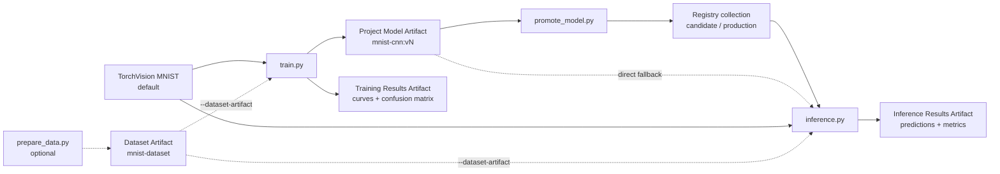

# W&B × PyTorch Onboarding: Train → Registry → Inference

This beginner demo trains and evaluates a PyTorch model on the complete public MNIST dataset, logs an exact Model Artifact version, links that version into W&B Registry as a `candidate`, and uses the Registry model in a separate inference Run. A direct Project-Artifact path remains available for users without an organization Registry.

Uploading MNIST as a Dataset Artifact is **optional**. The shortest path downloads MNIST directly through TorchVision.

> [!IMPORTANT]
> Never put a W&B API key in code or Git. It is a secret authentication credential used by the W&B SDK and CLI. Run `wandb login` once on a personal computer. In CI or on a cluster, store `WANDB_API_KEY` in the platform's secret manager.



## Choose a path

| Path | Account requirement | What it demonstrates |
|---|---|---|
| **Main Registry demo** | An organization Team, a Registry that accepts `model`, and link permission | Exact model version → `candidate` → governed inference |
| **Direct Artifact fallback** | A personal or Team entity | Training → inference without Registry |
| **Dataset Artifact add-on** | A personal or Team entity | Optional versioned MNIST input and data lineage |

## Privacy and scope: decide before you run

W&B Projects and W&B Registry are two separate scopes with separate access
controls:

| Area | Scope | What it contains in this example |
|---|---|---|
| **Project** | A Project owned by a personal entity or Team | The Project sidebar, Workspace, Runs, charts, and source Artifacts created by the scripts |
| **Registry** | One organization | Registries, collections, linked Artifact versions, lifecycle aliases, and Registry-specific roles |

When you open a Project, its sidebar shows Project pages such as **Workspace**,
**Runs**, and **Artifacts**. Registry is an organization-level application, so
it is normal for **Registry not to appear in the Project sidebar**. Open it from
W&B's global navigation under **Applications**, or go directly to
[W&B Registry](https://wandb.ai/registry/).

```text
Organization
├── Team
│   └── Project
│       ├── Workspace and Runs
│       └── source Model Artifact
└── Registry
    └── collection
        └── linked Model Artifact version
```

Project access and Registry access are governed and evaluated separately, even
when a role is inherited from an organization or Team. A source Artifact
inherits the access rules of its Project. Linking that version into a Registry
creates another access path to the linked model; it does not copy the payload
and does not automatically copy the Project's visibility setting. This leads to
two important cases:

- A **Restricted Registry** does not hide a source Artifact that remains in a
  Team-visible Project.
- A **Restricted Project** does not make a linked model private if its Registry
  has **Organization** visibility.

Promotion therefore requires both access to the exact source Artifact and a
Registry role allowed to link versions. Consumption separately requires a role
allowed to download and use the linked Artifact.

`candidate` and `production` are lifecycle aliases, **not access-control
settings**. Their names do not grant or revoke access. A protected alias can
restrict who may move that alias; Registry visibility and roles still control
access to the linked version.

Choose the access pattern that matches your goal:

| Goal | Project choice | Registry choice | Recommended path |
|---|---|---|---|
| **Personal Project, no Registry** | Use a non-public Project under your personal entity and verify its visibility before uploading | Do not use organization Registry | Use the Direct Artifact fallback |
| **Selected collaborators only** | Use a Team Project with **Restricted** visibility and invite only the required users or service accounts | Use a **Restricted** Registry and configure its members and roles separately | Use the Registry demo only after checking both access lists |
| **Team and organization sharing** | Use a Team-visible Project | Use an **Organization** Registry, subject to Registry roles | Use the main Registry demo |

Artifacts logged under a personal entity cannot be linked into an organization
Registry. If strict individual privacy is the requirement, use the direct
Project-Artifact workflow instead. If controlled Registry governance is the
requirement, restrict **both** the Team Project and the Registry. `Restricted`
is an RBAC boundary, not a promise that organization, Team, or Registry
administrators can never access or administer the resource.

See W&B's documentation for
[Restricted Projects](https://docs.wandb.ai/guides/hosting/iam/access-management/restricted-projects/),
[Registry visibility](https://docs.wandb.ai/models/registry/create_registry),
and [Registry roles](https://docs.wandb.ai/models/registry/configure_registry).

## Shared setup

All paths require Python 3.10 or newer. Run commands from this directory.

### 1. Install the packages

```bash
python -m venv .venv
source .venv/bin/activate
python -m pip install --upgrade pip
python -m pip install -r requirements.txt
```

On Windows PowerShell, activate the environment with:

```powershell
.\.venv\Scripts\Activate.ps1
```

### 2. Log in

```bash
wandb login
```

## Main demo: model workflow in W&B Registry

This path requires an organization Team, an existing compatible Registry, and permission to link Model Artifacts.

### 1. Select the Team

```bash
wandb init --project pytorch-mnist-onboarding
```

When `wandb init` asks where to create the Project, select an organization **Team**, not your personal entity. If the Team page is `https://wandb.ai/my-team`, its entity is `my-team`. Registry cannot link a source Model Artifact logged under a personal entity.

You can also set the Team explicitly after replacing the value with your actual Team slug:

```bash
export WANDB_ENTITY="my-team"
export WANDB_PROJECT="pytorch-mnist-onboarding"
```

On Windows PowerShell:

```powershell
$env:WANDB_ENTITY="my-team"
$env:WANDB_PROJECT="pytorch-mnist-onboarding"
```

Before training, open the Project's visibility control and confirm **Project
visibility**. Choose **Restricted**, then use the Project's **Users** settings
to invite only the intended collaborators when the source Runs and Artifacts
must not be visible to every member of the Team.

### 2. Find the Registry name

Open [W&B Registry](https://wandb.ai/registry/), then select an existing Registry that accepts the `model` Artifact type. If no compatible Registry exists, create one in that UI first and allow the `model` type. Choose **Organization** visibility only when the linked model is intended for the wider organization; otherwise choose **Restricted** and explicitly configure its members and roles. Copy the Registry's displayed name exactly; the name shown in your UI is the source of truth.

The examples below use a Registry named `Models`:

```bash
export REGISTRY_NAME="Models"
```

On Windows PowerShell:

```powershell
$env:REGISTRY_NAME="Models"
```

If your Registry has another name, replace `Models`. The collection `mnist-cnn` can be created by the link operation when your role and the Registry type policy permit it.

### 3. Train and capture the exact Model Artifact version

```bash
python train.py
```

TorchVision downloads MNIST automatically on the first run. Training uses 55,000 images, validation uses 5,000 images, and final testing uses all 10,000 official test images. The default is three epochs.

At the end, copy the complete line printed by the script:

```text
Model Artifact: my-team/pytorch-mnist-onboarding/mnist-cnn:v0
```

Your Team and version can differ. Use the exact returned `vN`; do not replace it with `latest` and do not guess the next version number.

### 4. Link that exact version to Registry as `candidate`

If training printed the example above, run:

```bash
python promote_model.py --model-artifact "my-team/pytorch-mnist-onboarding/mnist-cnn:v0" --registry "$REGISTRY_NAME" --collection "mnist-cnn" --alias "candidate"
```

On Windows PowerShell, use `$env:REGISTRY_NAME`:

```powershell
python promote_model.py --model-artifact "my-team/pytorch-mnist-onboarding/mnist-cnn:v0" --registry "$env:REGISTRY_NAME" --collection "mnist-cnn" --alias "candidate"
```

Replace only `--model-artifact` with the exact value printed by your own training Run. `promote_model.py` rejects `:latest` so the promotion decision always names one immutable source version. It links the existing Artifact object and does not upload another checkpoint copy.

The script prints both identities. The following is schematic notation, not a
command to copy:

```text
Source Model Artifact: TEAM/PROJECT/mnist-cnn:vN
Registry Model: ORG/wandb-registry-REGISTRY/mnist-cnn:vN
Registry alias: ORG/wandb-registry-REGISTRY/mnist-cnn:candidate
```

Source and Registry `vN` counters are independent, so they do not always have the same number. W&B includes your real organization in the printed Registry reference; copy the complete runtime value exactly.

The final output line begins with `Next command:`. It already contains the real organization-qualified Registry alias and the promotion Run's resolved Team and Project. Copy everything after `Next command:` and run it exactly as printed.

### 5. Run inference from the Registry `candidate`

Run the exact command printed after `Next command:`. It resolves `candidate` to one linked Registry version, downloads the original Model Artifact, rebuilds `MNISTCNN` with `model.py`, evaluates all 10,000 test images, and records both the requested alias and resolved immutable version.

### 6. Review and promote to `production`

In the Registry Web UI, open the `mnist-cnn` collection and its candidate version, then inspect the metrics, metadata, lineage, and files. When it is approved, use the plus control beside **Aliases** to add or move `production` to that version. A protected alias can require Registry-admin permission.

After assigning that production alias in the UI, copy your previously printed `Next command` and change only the final `:candidate` suffix inside its `--model-artifact` value to `:production`. Aliases intentionally move as models are promoted. For an audited rerun that must never follow a later promotion, use the exact `Registry Model: ...:vN` value printed by `promote_model.py`.

No Dataset Artifact is required for this Registry workflow.

## No Team or Registry? Direct Artifact fallback

This is still an online W&B workflow: it skips Registry, but it still creates
Runs and uploads metrics, media, and Project Artifacts. The simple
personal-account path is:

```bash
python train.py
python inference.py --model-artifact "mnist-cnn:latest"
```

This explicitly downloads the Project Artifact `mnist-cnn:latest`. It demonstrates model saving and loading but not Registry governance. Because installation and login are shared setup, no Team selection or Registry setup is needed for this path when your account default entity is correct.

Skipping Registry does not make the Project private. For personal use, pass
your actual personal entity and verify that the destination Project is not
public or Team-visible before running the scripts.

## Optional: version MNIST as a Dataset Artifact

Use this path only when you want W&B to version the input data and show explicit data lineage.

```bash
python prepare_data.py
```

`prepare_data.py` downloads MNIST, saves a deterministic 55,000/5,000 train/validation split, uploads it, and prints an exact value such as:

```text
Dataset Artifact: my-team/pytorch-mnist-onboarding/mnist-dataset:v0
```

Copy that exact value into training and inference so both consume the same immutable dataset version. The direct-Artifact variant is:

```bash
python train.py --dataset-artifact "my-team/pytorch-mnist-onboarding/mnist-dataset:v0"
python inference.py --dataset-artifact "my-team/pytorch-mnist-onboarding/mnist-dataset:v0" --model-artifact "mnist-cnn:latest"
```

For Registry-based inference, the dataset-backed training Run creates a new Model Artifact version. Copy its newly printed `Model Artifact: ...:vN`, link that exact new version, and then run the `Next command` printed by `promote_model.py`. Add your exact Dataset Artifact as `--dataset-artifact` when running that command.

```bash
python promote_model.py --model-artifact "my-team/pytorch-mnist-onboarding/mnist-cnn:v1" --registry "$REGISTRY_NAME" --collection "mnist-cnn" --alias "candidate"
```

The displayed `v0`/`v1`, Team, organization, and Registry names are examples. Use the exact Dataset, Model, and Registry references printed by your own Runs. Passing `--dataset-artifact` makes training or inference record and download that Artifact instead of using the local TorchVision copy.

## What is uploaded to W&B

| W&B object | Default name | Created when | Contents |
|---|---|---|---|
| Training Run | W&B-generated name | When `train.py` runs | Config, epoch metrics, final test metrics, and plots in the UI |
| Source Model Artifact | `TEAM/PROJECT/mnist-cnn:vN` | When `train.py` runs | Immutable trained PyTorch state dictionary |
| Training Results Artifact | `mnist-training-results:latest` | When `train.py` runs | Training curves, test confusion matrix, and `metrics.json` |
| Promotion Run | W&B-generated name | When `promote_model.py` runs | Exact source, Registry destination, and assigned alias |
| Linked Registry version | `ORG/wandb-registry-REGISTRY/mnist-cnn:vN` | When promotion runs | Pointer to the source Model Artifact; no duplicate model payload |
| Registry alias | `candidate` or `production` | When assigned to a Registry version | Movable lifecycle name within the collection |
| Inference Run | W&B-generated name | When `inference.py` runs | Requested model reference, resolved model lineage, metrics, and prediction plot |
| Inference Results Artifact | `mnist-inference-results:latest` | When `inference.py` runs | Prediction plot and inference metrics |
| Data Preparation Run | W&B-generated name | Only if `prepare_data.py` runs | Dataset metadata and the Dataset Artifact |
| Dataset Artifact | `mnist-dataset:latest` | Only if `prepare_data.py` runs | MNIST files, split indices, and the dataset license notice |

The PNG files are logged in two useful ways:

- `wandb.Image(...)` displays each plot directly in the Run workspace.
- A results Artifact keeps the PNG and its matching JSON metrics together as a versioned file bundle.

## Code organization

### `model.py`: ordinary PyTorch code, no W&B import

All ordinary model, data, training, evaluation, and plotting code is in one W&B-free file:

- `MNISTCNN` defines the neural network.
- `select_device()` chooses CUDA, Apple silicon, or CPU.
- `prepare_mnist_data()` downloads MNIST and creates split indices.
- `build_loaders()` creates training, validation, and test loaders.
- `build_test_loader()` creates the inference test loader.
- `train_one_epoch()` contains the forward, backward, and optimizer steps.
- `evaluate()` calculates loss, accuracy, predictions, and labels.
- `run_inference()` evaluates the downloaded model.
- `save_result_plots()` creates the training curves and confusion matrix.
- `save_prediction_plot()` creates the inference prediction grid.

### W&B-facing scripts

- `train.py` calls the ordinary PyTorch functions, logs metrics and plots, and uploads the model and training results.
- `promote_model.py` links one exact source Model Artifact into a Registry collection and assigns a lifecycle alias without re-uploading the model.
- `inference.py` downloads either a Project Model Artifact or a Registry model, calls the ordinary inference functions, and uploads inference results.
- `prepare_data.py` is the optional Dataset Artifact publisher.

This separation makes the boundary visible: `model.py` is the machine-learning code; the other scripts show where W&B connects to it.

## Where W&B is used

W&B-specific sections have visible labels:

| Code label | Meaning |
|---|---|
| `[W&B CORE]` | Imports W&B or starts one Run with `wandb.init()` |
| `[W&B WORKFLOW]` | Keeps related data, training, and inference jobs in the same Project |
| `[W&B METRICS]` | Sends scalar metrics with `run.log()` |
| `[W&B METRICS + MEDIA]` | Sends metrics and PNG plots to the W&B UI |
| `[W&B ARTIFACT INPUT]` | Records an Artifact as input and downloads its files |
| `[W&B ARTIFACT OUTPUT]` | Uploads a versioned dataset, model, or results bundle |
| `[W&B ARTIFACT VERSION]` | Reads the immutable server-assigned `vN` after upload |
| `[W&B REGISTRY]` | Links an existing exact Model Artifact into a Registry collection |
| `[W&B MODEL INPUT]` | Resolves and downloads a Project or Registry model for inference |
| `[W&B SUMMARY]` | Stores final searchable provenance or decision fields |
| `[W&B TEST SAFETY]` | Prevents automated tests from using real W&B service entry points |
| `[W&B RECOMMENDED]` | Adds useful `config` or `job_type` metadata |
| `[W&B OPTIONAL]` | Adds an optional setting or convenience |

### Which W&B pieces are required?

| Goal | What is needed |
|---|---|
| Create an online W&B Run | Install/import `wandb`, make valid authentication available, and call `wandb.init()` |
| Add custom metrics or plots | Call `run.log()` after `wandb.init()` |
| Run direct training → inference | Upload the Project Model Artifact in training, then download it in inference |
| Run the Registry demo | Train under an organization Team, use the exact source `vN`, link it to a compatible Registry with permission, then consume the Registry reference |
| Keep plot and metric files versioned | Upload the training and inference Results Artifacts |
| Version the public input data | Optional: run `prepare_data.py` and pass `--dataset-artifact` |
| Use short Artifact names across the scripts | Keep the same `project` and `entity` |
| Add searchable settings and job descriptions | `config` and `job_type` are recommended, not required by W&B |
| Target a non-default Team | Set `entity` to that Team slug; omit it when the account default is correct |

The smallest metric-tracking pattern is:

```python
import wandb  # [W&B CORE]

with wandb.init(  # [W&B CORE]
    project="pytorch-mnist-onboarding",  # [W&B WORKFLOW]
) as run:
    # Ordinary PyTorch code
    run.log({"train/loss": train_loss})  # [W&B METRICS]
```

Dataset Artifact input is a separate, optional block in `train.py` and `inference.py`:

```python
if args.dataset_artifact:
    # [W&B ARTIFACT INPUT] OPTIONAL: versioned data and lineage
    dataset_artifact = run.use_artifact(args.dataset_artifact, type="dataset")
    dataset_path = dataset_artifact.download()
```

## API, SDK, CLI, and Web UI

| Term | Plain-English meaning | Example here |
|---|---|---|
| W&B Python SDK (`wandb` package) | W&B's ready-made Python toolkit; installing it also provides the CLI | `pip install wandb`, then `import wandb` |
| Python API | All public Python functions, classes, and methods in that package | `wandb.init()`, `run.log()`, and `wandb.Artifact()` |
| Web API | The communication rules between your computer and W&B's servers | The SDK handles this for you |
| W&B CLI | W&B commands typed in a terminal | `wandb login` |
| Web UI | The W&B website where you inspect Runs, charts, and Artifacts | The Project workspace in a browser |

`wandb.init()` is one function in the Python API. The SDK contains that function and handles Web API communication behind the scenes. An API key is not an API or a Python function; it is a secret credential used for authentication.

## Artifact contents

### Model Artifact

```text
Project source:  TEAM/PROJECT/mnist-cnn:vN
└── mnist_cnn_state_dict.pt

Registry link:  ORG/wandb-registry-REGISTRY/mnist-cnn:candidate
Exact link:     ORG/wandb-registry-REGISTRY/mnist-cnn:vN
```

The Project Artifact stores the learned weights. Registry links that Artifact into a governed collection; linking does not copy the model bytes. `inference.py` uses the matching `MNISTCNN` definition in `model.py` before loading the weights.

These names serve different purposes:

| Name | Meaning |
|---|---|
| `TEAM/PROJECT/mnist-cnn:vN` | Immutable source Model Artifact produced by training |
| `ORG/wandb-registry-REGISTRY/mnist-cnn:vN` | Immutable version within the Registry collection |
| `...:candidate` | Movable Registry alias for a model under review |
| `...:production` | Movable Registry alias for the approved model |
| Project `mnist-cnn:latest` | Most recently logged source version; it does not mean production-approved |

### Training Results Artifact

```text
mnist-training-results:latest
├── training_curves.png
├── test_confusion_matrix.png
└── metrics.json
```

### Inference Results Artifact

```text
mnist-inference-results:latest
├── inference_predictions.png
└── inference_metrics.json
```

### Optional Dataset Artifact

```text
mnist-dataset:latest
├── MNIST/raw/...       # Complete MNIST files
├── split_indices.pt    # 55,000 train + 5,000 validation indices
└── MNIST_LICENSE.md    # Source, attribution, and license notice
```

MNIST was created by Yann LeCun, Corinna Cortes, and Christopher J. C. Burges from the original NIST datasets. The TensorFlow/Keras documentation identifies its license as [Creative Commons Attribution-ShareAlike 3.0](https://creativecommons.org/licenses/by-sa/3.0/). This example downloads it through [TorchVision](https://docs.pytorch.org/vision/stable/generated/torchvision.datasets.MNIST.html).

If you publish the optional Dataset Artifact, keep `MNIST_LICENSE.md` with it, retain the attribution, and review the [original MNIST source](https://yann.lecun.com/exdb/mnist/) and [license reference](https://www.tensorflow.org/api_docs/python/tf/keras/datasets/mnist/load_data) together with your organization's data-sharing policy.

## Project and entity

The data-preparation, training, and inference scripts use environment variables first, then these fallbacks:

```text
project = $WANDB_PROJECT, otherwise pytorch-mnist-onboarding
entity  = $WANDB_ENTITY, otherwise your account's default entity
```

`promote_model.py` instead derives its default Team and Project from the required fully qualified source Model Artifact.

For the direct fallback, do not pass `--entity` if your account default is correct. For Registry, the source Model Artifact must be logged to a Team inside the Registry's organization. A personal-entity Artifact cannot be linked later.

The least error-prone setup is interactive:

```bash
wandb init --project pytorch-mnist-onboarding
```

Select the intended Team when prompted. To verify the slug, open its profile: in `https://wandb.ai/my-team`, `my-team` is the entity value. Do not type the example literally unless that is actually your Team URL.

You can then set reusable values with your real slug:

```bash
export WANDB_ENTITY="my-team"  # Example: replace my-team
export WANDB_PROJECT="pytorch-mnist-onboarding"
```

If you use optional Dataset Artifact versioning, keep the same Team and Project for `prepare_data.py`, `train.py`, and `inference.py`. For an Artifact in another Project, use `ENTITY/PROJECT/ARTIFACT:VERSION_OR_ALIAS`, for example `my-team/my-project/mnist-cnn:v0`.

## Main command-line options

### Shared W&B options

| Argument | Default | Purpose |
|---|---|---|
| `--project` | `$WANDB_PROJECT`, otherwise `pytorch-mnist-onboarding` | W&B Project used by data, training, and inference Runs |
| `--entity` | `$WANDB_ENTITY`, otherwise account default | Optional user or Team slug |

### Training

| Argument | Default | Purpose |
|---|---|---|
| `--data-dir` | `data` | Local TorchVision MNIST cache |
| `--dataset-artifact` | Not used | Optional input Dataset Artifact |
| `--model-artifact-name` | `mnist-cnn` | Output Model Artifact |
| `--results-artifact-name` | `mnist-training-results` | Output Results Artifact |
| `--epochs` | `3` | Complete training epochs |
| `--batch-size` | `64` | Training/evaluation batch size |
| `--learning-rate` | `0.001` | Adam learning rate |
| `--seed` | `42` | Local split and PyTorch training seed; an Artifact already contains its split |
| `--artifact-dir` | `artifacts` | Optional Dataset Artifact download directory |
| `--output-dir` | `outputs` | Checkpoint, plot, and metric files |

### Inference

| Argument | Default | Purpose |
|---|---|---|
| `--data-dir` | `data` | Local TorchVision MNIST cache |
| `--dataset-artifact` | Not used | Optional input Dataset Artifact |
| `--model-artifact` | `mnist-cnn:latest` | Project or Registry Model Artifact reference |
| `--results-artifact-name` | `mnist-inference-results` | Output Results Artifact |
| `--batch-size` | `128` | Inference batch size |
| `--artifact-dir` | `artifacts` | Artifact download directory |
| `--output-dir` | `outputs/inference` | Prediction plot and metric file |

### Registry promotion

| Argument | Default | Purpose |
|---|---|---|
| `--model-artifact` | Required | Exact fully qualified source printed by training: `TEAM/PROJECT/NAME:vN` |
| `--registry` | Required | Exact existing Registry name from the Web UI |
| `--collection` | `mnist-cnn` | Registry collection for this model use case |
| `--alias` | `candidate` | Movable Registry lifecycle alias assigned by this promotion |
| `--entity` | Source Team | Team used for the promotion Run |
| `--project` | Source Project | Project used for the promotion Run |

### Optional data preparation

| Argument | Default | Purpose |
|---|---|---|
| `--data-dir` | `data` | Local MNIST cache |
| `--artifact-name` | `mnist-dataset` | Output Dataset Artifact |
| `--seed` | `42` | Train/validation split seed |

## Version and workflow notes

- The Registry demo order is `train.py` → `promote_model.py` → `inference.py` with the printed Registry reference.
- The direct fallback order is `train.py` → `inference.py`, which uses Project alias `mnist-cnn:latest` by default.
- Project source `vN` and Registry collection `vN` are separate version namespaces and their numbers need not match.
- Project alias `latest` is separate from Registry aliases such as `candidate` and `production`.
- `candidate` and `production` are user-assigned lifecycle aliases, not automatic W&B stages. Registry `latest` moves automatically to the most recently linked version.
- `candidate`, `production`, and Registry `latest` are movable. Use a Registry `:vN` when inference must remain pinned to one exact linked version.
- Reassigning `production` changes what future alias-based inference Runs consume and can require additional permission when the alias is protected.
- Registry linking creates a pointer to the existing Model Artifact; it does not upload a duplicate checkpoint.
- `prepare_data.py` is not part of the default path. Run it first only when using `--dataset-artifact`.
- Pass `--dataset-artifact` to both training and inference when you want both Runs linked to the Dataset Artifact. Use the same pinned version, such as `mnist-dataset:v0`, when both Runs must consume exactly the same data version.
- `:latest` is a moving alias. To pin Artifact inputs, use versions such as `mnist-cnn:v0` and `mnist-dataset:v0`; hardware, package versions, and nondeterministic operations can still affect results.
- W&B deduplicates unchanged Artifact content, but the first optional Dataset Artifact upload still transfers the complete MNIST files.

## Test the code without changing W&B Cloud

The automated tests replace W&B's service calls with local fakes. They verify exact-version promotion, alias rejection, object-preserving Registry linking, Registry-based inference, and the W&B-free `model.py` boundary without creating Runs or Registry links.

```bash
python -m pip install -r requirements-dev.txt
python -m pytest -q
```

The real `prepare_data.py`, `train.py`, `promote_model.py`, and `inference.py` commands are intentional online mutations and must be verified in your own W&B Web UI.

## Troubleshooting

### No W&B credential is configured

```bash
wandb login
```

In CI or on a cluster, configure `WANDB_API_KEY` as a secret. Never place its value in Python, Markdown, shell scripts, GitHub workflow YAML, or Git history.

### Model Artifact not found

1. Confirm that `python train.py` completed successfully.
2. Confirm that training and inference use the same `project` and `entity`.
3. Check the exact name and version in the W&B Project's Artifacts page.
4. When reading across Projects, pass a fully qualified name such as `my-team/my-project/mnist-cnn:v0`.

### Registry promotion rejects the source

1. Copy the exact fully qualified `Model Artifact: ...:vN` printed by `train.py`; `:latest` is intentionally rejected.
2. Confirm that the source was logged under a Team, not a personal entity.
3. Confirm that the Team belongs to the same organization as the Registry.
4. Open [W&B Registry](https://wandb.ai/registry/) and verify the exact Registry name, that it accepts type `model`, and that your Registry role can link versions.

### Registry does not exist

If `promote_model.py` says it could not link the model and the original W&B error says the Registry was not found, open [W&B Registry](https://wandb.ai/registry/), create the Registry under the intended organization with support for the `model` Artifact type, copy its exact displayed name into `--registry`, and rerun the same promotion command.

The friendly error keeps the original W&B error at the end. If that original reason mentions permissions instead of a missing Registry, ask a Registry administrator for link access rather than creating another Registry.

### Registry is missing from the Project sidebar

This is expected. **Workspace**, **Runs**, and **Artifacts** belong to the
current Project, while Registry belongs to the organization. Leave the Project
navigation and open Registry from W&B's global **Applications** navigation, or
go directly to [wandb.ai/registry](https://wandb.ai/registry/).

### Registry alias or collection not found during inference

Open the linked version in Registry, select its **Usage** tab, and copy the full reference shown there. Confirm that `candidate` or `production` is currently attached to a version. Users who belong to multiple organizations should initialize the inference Run with the same Team entity used for training.

### `production` cannot be moved

The alias may be protected or your Registry role may not allow the update. Use `candidate` for the first demo, then ask a Registry admin to approve or move the protected production alias.

### Dataset Artifact not found

This only applies to the optional path. Confirm that `prepare_data.py` completed and that all commands use the same Project and entity. Otherwise, omit `--dataset-artifact` and let TorchVision download MNIST directly.

### MNIST cannot be downloaded

Confirm that the machine can reach the public internet. On an institutional network, install the trusted CA certificate with help from IT. Do not disable TLS certificate verification.

## GitHub checklist

The included `.gitignore` excludes local credentials, virtual environments, data, downloaded Artifacts, outputs, W&B run files, and PyTorch checkpoints.

Before publishing:

- revoke and rotate any key that was ever committed; deleting it from the current file does not remove it from Git history;
- confirm that the repository contains no private paths, usernames, endpoints, or credentials;
- add a code `LICENSE` appropriate for your personal or organizational policy;
- publish this standalone directory rather than the internal MLflow/Frontier examples in the parent repository.

## Project structure

```text
wandb_pytorch_onboarding/
├── README.md          # This onboarding guide
├── model.py           # All ordinary PyTorch/data/evaluation/plot functions
├── train.py           # Training orchestration and W&B integration
├── promote_model.py   # Exact Model Artifact → Registry link and alias
├── inference.py       # Project/Registry model inference and W&B integration
├── prepare_data.py    # Optional Dataset Artifact publisher
├── tests/             # Local fake-W&B Registry workflow tests
├── MNIST_LICENSE.md   # Dataset notice included in the optional Artifact
├── requirements.txt   # Runtime packages
├── requirements-dev.txt # Runtime packages plus Pytest
└── .gitignore         # Local data, downloads, outputs, and credentials
```

## Official references

- [W&B PyTorch integration](https://docs.wandb.ai/models/integrations/pytorch)
- [W&B Artifacts overview](https://docs.wandb.ai/models/artifacts)
- [`Run.use_artifact()` and `Run.log_artifact()`](https://docs.wandb.ai/models/ref/python/experiments/run)
- [W&B Registry overview](https://docs.wandb.ai/models/registry)
- [Link an Artifact version to Registry](https://docs.wandb.ai/models/registry/link_version)
- [Use a model from Registry](https://docs.wandb.ai/models/registry/download_use_artifact)
- [Registry aliases](https://docs.wandb.ai/models/registry/aliases)
- [W&B environment variables](https://docs.wandb.ai/models/track/environment-variables)
- [TorchVision MNIST](https://docs.pytorch.org/vision/stable/generated/torchvision.datasets.MNIST.html)
