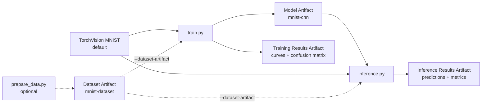

# W&B × PyTorch Onboarding: Training → Artifacts → Inference

This beginner example trains and evaluates a PyTorch model on the complete public MNIST dataset, records metrics and plots in W&B, saves the trained model as an Artifact, and uses that Artifact in a separate inference Run.

Uploading MNIST as a Dataset Artifact is **optional**. The shortest path downloads MNIST directly through TorchVision.

> [!IMPORTANT]
> Never put a W&B API key in code or Git. It is a secret authentication credential used by the W&B SDK and CLI. Run `wandb login` once on a personal computer. In CI or on a cluster, store `WANDB_API_KEY` in the platform's secret manager.



## Quickstart: simplest path

This example requires Python 3.10 or newer. Run all commands from this directory.

### 1. Install the packages

```bash
python -m venv .venv
source .venv/bin/activate
python -m pip install --upgrade pip
python -m pip install -r requirements.txt
```

On Windows PowerShell, activate the environment with:

```powershell
.venv\Scripts\Activate.ps1
```

### 2. Log in to W&B

```bash
wandb login
```

### 3. Train and evaluate

```bash
python train.py
```

TorchVision downloads MNIST automatically on the first run. Training uses 55,000 images, validation uses 5,000 images, and final testing uses all 10,000 official test images. The default is three epochs.

### 4. Run inference from the Model Artifact

```bash
python inference.py
```

This downloads `mnist-cnn:latest` from W&B, rebuilds the model with `model.py`, evaluates all 10,000 test images, and uploads a 16-image prediction plot and inference metrics.

That is the complete default workflow. No Dataset Artifact is required.

## Optional: version MNIST as a Dataset Artifact

Use this path only when you want W&B to version the input data and show explicit data lineage.

```bash
python prepare_data.py
python train.py --dataset-artifact mnist-dataset:latest
python inference.py --dataset-artifact mnist-dataset:latest
```

`prepare_data.py` downloads MNIST, saves a deterministic 55,000/5,000 train/validation split, and uploads both as `mnist-dataset:latest`. Passing `--dataset-artifact` makes training or inference record and download that Artifact instead of using the local TorchVision copy.

## What is uploaded to W&B

| W&B object | Default name | Created when | Contents |
|---|---|---|---|
| Training Run | W&B-generated name | When `train.py` runs | Config, epoch metrics, final test metrics, and plots in the UI |
| Model Artifact | `mnist-cnn:latest` | When `train.py` runs | Trained PyTorch state dictionary |
| Training Results Artifact | `mnist-training-results:latest` | When `train.py` runs | Training curves, test confusion matrix, and `metrics.json` |
| Inference Run | W&B-generated name | When `inference.py` runs | Model lineage, test metrics, and prediction plot |
| Inference Results Artifact | `mnist-inference-results:latest` | When `inference.py` runs | Prediction plot and inference metrics |
| Data Preparation Run | W&B-generated name | Only if `prepare_data.py` runs | Dataset metadata and the Dataset Artifact |
| Dataset Artifact | `mnist-dataset:latest` | Only if `prepare_data.py` runs | MNIST files, split indices, and the dataset license notice |

The PNG files are logged in two useful ways:

- `wandb.Image(...)` displays each plot directly in the Run workspace.
- A results Artifact keeps the PNG and its matching JSON metrics together as a versioned file bundle.

## Code organization

### `model.py`: ordinary PyTorch code, no W&B import

All ordinary model, data, training, evaluation, and plotting code is in one W&B-free file:

- `MNISTCNN` defines the neural network.
- `select_device()` chooses CUDA, Apple silicon, or CPU.
- `prepare_mnist_data()` downloads MNIST and creates split indices.
- `build_loaders()` creates training, validation, and test loaders.
- `build_test_loader()` creates the inference test loader.
- `train_one_epoch()` contains the forward, backward, and optimizer steps.
- `evaluate()` calculates loss, accuracy, predictions, and labels.
- `run_inference()` evaluates the downloaded model.
- `save_result_plots()` creates the training curves and confusion matrix.
- `save_prediction_plot()` creates the inference prediction grid.

### W&B-facing scripts

- `train.py` calls the ordinary PyTorch functions, logs metrics and plots, and uploads the model and training results.
- `inference.py` downloads the Model Artifact, calls the ordinary inference functions, and uploads inference results.
- `prepare_data.py` is the optional Dataset Artifact publisher.

This separation makes the boundary visible: `model.py` is the machine-learning code; the other three scripts show where W&B connects to it.

## Where W&B is used

W&B-specific sections have visible labels:

| Code label | Meaning |
|---|---|
| `[W&B CORE]` | Imports W&B or starts one Run with `wandb.init()` |
| `[W&B WORKFLOW]` | Keeps related data, training, and inference jobs in the same Project |
| `[W&B METRICS]` | Sends scalar metrics with `run.log()` |
| `[W&B METRICS + MEDIA]` | Sends metrics and PNG plots to the W&B UI |
| `[W&B ARTIFACT INPUT]` | Records an Artifact as input and downloads its files |
| `[W&B ARTIFACT OUTPUT]` | Uploads a versioned dataset, model, or results bundle |
| `[W&B RECOMMENDED]` | Adds useful `config` or `job_type` metadata |
| `[W&B OPTIONAL]` | Adds an optional setting or convenience |

### Which W&B pieces are required?

| Goal | What is needed |
|---|---|
| Create an online W&B Run | Install/import `wandb`, make valid authentication available, and call `wandb.init()` |
| Add custom metrics or plots | Call `run.log()` after `wandb.init()` |
| Run this training → inference example | Upload the Model Artifact in training, then download it in inference |
| Keep plot and metric files versioned | Upload the training and inference Results Artifacts |
| Version the public input data | Optional: run `prepare_data.py` and pass `--dataset-artifact` |
| Use short Artifact names across the scripts | Keep the same `project` and `entity` |
| Add searchable settings and job descriptions | `config` and `job_type` are recommended, not required by W&B |
| Target a non-default Team | Set `entity` to that Team slug; omit it when the account default is correct |

The smallest metric-tracking pattern is:

```python
import wandb  # [W&B CORE]

with wandb.init(  # [W&B CORE]
    project="pytorch-mnist-onboarding",  # [W&B WORKFLOW]
) as run:
    # Ordinary PyTorch code
    run.log({"train/loss": train_loss})  # [W&B METRICS]
```

Dataset Artifact input is a separate, optional block in `train.py` and `inference.py`:

```python
if args.dataset_artifact:
    # [W&B ARTIFACT INPUT] OPTIONAL: versioned data and lineage
    dataset_artifact = run.use_artifact(args.dataset_artifact, type="dataset")
    dataset_path = dataset_artifact.download()
```

## API, SDK, CLI, and Web UI

| Term | Plain-English meaning | Example here |
|---|---|---|
| W&B Python SDK (`wandb` package) | W&B's ready-made Python toolkit; installing it also provides the CLI | `pip install wandb`, then `import wandb` |
| Python API | All public Python functions, classes, and methods in that package | `wandb.init()`, `run.log()`, and `wandb.Artifact()` |
| Web API | The communication rules between your computer and W&B's servers | The SDK handles this for you |
| W&B CLI | W&B commands typed in a terminal | `wandb login` |
| Web UI | The W&B website where you inspect Runs, charts, and Artifacts | The Project workspace in a browser |

`wandb.init()` is one function in the Python API. The SDK contains that function and handles Web API communication behind the scenes. An API key is not an API or a Python function; it is a secret credential used for authentication.

## Artifact contents

### Model Artifact

```text
mnist-cnn:latest
└── mnist_cnn_state_dict.pt
```

The Artifact stores the learned weights. `inference.py` uses the matching `MNISTCNN` definition in `model.py` before loading them.

### Training Results Artifact

```text
mnist-training-results:latest
├── training_curves.png
├── test_confusion_matrix.png
└── metrics.json
```

### Inference Results Artifact

```text
mnist-inference-results:latest
├── inference_predictions.png
└── inference_metrics.json
```

### Optional Dataset Artifact

```text
mnist-dataset:latest
├── MNIST/raw/...       # Complete MNIST files
├── split_indices.pt    # 55,000 train + 5,000 validation indices
└── MNIST_LICENSE.md    # Source, attribution, and license notice
```

MNIST was created by Yann LeCun, Corinna Cortes, and Christopher J. C. Burges from the original NIST datasets. The TensorFlow/Keras documentation identifies its license as [Creative Commons Attribution-ShareAlike 3.0](https://creativecommons.org/licenses/by-sa/3.0/). This example downloads it through [TorchVision](https://docs.pytorch.org/vision/stable/generated/torchvision.datasets.MNIST.html).

If you publish the optional Dataset Artifact, keep `MNIST_LICENSE.md` with it, retain the attribution, and review the [original MNIST source](https://yann.lecun.com/exdb/mnist/) and [license reference](https://www.tensorflow.org/api_docs/python/tf/keras/datasets/mnist/load_data) together with your organization's data-sharing policy.

## Project and entity

The scripts default to:

```text
project = pytorch-mnist-onboarding
entity  = your W&B account's default entity
```

For a personal test, do not pass `--entity`. To use a Team, pass the same Team slug and Project to every command:

```bash
python train.py     --entity YOUR_TEAM_SLUG --project pytorch-mnist-onboarding
python inference.py --entity YOUR_TEAM_SLUG --project pytorch-mnist-onboarding
```

If you use the optional data-versioning path, pass the same values to `prepare_data.py` as well.

You can also set shared defaults:

```bash
export WANDB_ENTITY=YOUR_TEAM_SLUG
export WANDB_PROJECT=pytorch-mnist-onboarding
```

For an Artifact in another Project, use `ENTITY/PROJECT/ARTIFACT:VERSION_OR_ALIAS`, for example `my-team/my-project/mnist-cnn:v0`.

## Main command-line options

### Shared W&B options

| Argument | Default | Purpose |
|---|---|---|
| `--project` | `pytorch-mnist-onboarding` | W&B Project used by the workflow |
| `--entity` | Account default | Optional user or Team slug |

### Training

| Argument | Default | Purpose |
|---|---|---|
| `--data-dir` | `data` | Local TorchVision MNIST cache |
| `--dataset-artifact` | Not used | Optional input Dataset Artifact |
| `--model-artifact-name` | `mnist-cnn` | Output Model Artifact |
| `--results-artifact-name` | `mnist-training-results` | Output Results Artifact |
| `--epochs` | `3` | Complete training epochs |
| `--batch-size` | `64` | Training/evaluation batch size |
| `--learning-rate` | `0.001` | Adam learning rate |
| `--seed` | `42` | Local split and PyTorch training seed; an Artifact already contains its split |
| `--artifact-dir` | `artifacts` | Optional Dataset Artifact download directory |
| `--output-dir` | `outputs` | Checkpoint, plot, and metric files |

### Inference

| Argument | Default | Purpose |
|---|---|---|
| `--data-dir` | `data` | Local TorchVision MNIST cache |
| `--dataset-artifact` | Not used | Optional input Dataset Artifact |
| `--model-artifact` | `mnist-cnn:latest` | Required input Model Artifact |
| `--results-artifact-name` | `mnist-inference-results` | Output Results Artifact |
| `--batch-size` | `128` | Inference batch size |
| `--artifact-dir` | `artifacts` | Artifact download directory |
| `--output-dir` | `outputs/inference` | Prediction plot and metric file |

### Optional data preparation

| Argument | Default | Purpose |
|---|---|---|
| `--data-dir` | `data` | Local MNIST cache |
| `--artifact-name` | `mnist-dataset` | Output Dataset Artifact |
| `--seed` | `42` | Train/validation split seed |

## Version and workflow notes

- Run `train.py` before `inference.py` so `mnist-cnn:latest` exists.
- `prepare_data.py` is not part of the default path. Run it first only when using `--dataset-artifact`.
- Pass `--dataset-artifact` to both training and inference when you want both Runs linked to the Dataset Artifact. Use the same pinned version, such as `mnist-dataset:v0`, when both Runs must consume exactly the same data version.
- `:latest` is a moving alias. To pin Artifact inputs, use versions such as `mnist-cnn:v0` and `mnist-dataset:v0`; hardware, package versions, and nondeterministic operations can still affect results.
- W&B deduplicates unchanged Artifact content, but the first optional Dataset Artifact upload still transfers the complete MNIST files.

## Troubleshooting

### No W&B credential is configured

```bash
wandb login
```

In CI or on a cluster, configure `WANDB_API_KEY` as a secret. Never place its value in Python, Markdown, shell scripts, GitHub workflow YAML, or Git history.

### Model Artifact not found

1. Confirm that `python train.py` completed successfully.
2. Confirm that training and inference use the same `project` and `entity`.
3. Check the exact name and version in the W&B Project's Artifacts page.
4. When reading across Projects, pass a fully qualified name such as `my-team/my-project/mnist-cnn:v0`.

### Dataset Artifact not found

This only applies to the optional path. Confirm that `prepare_data.py` completed and that all commands use the same Project and entity. Otherwise, omit `--dataset-artifact` and let TorchVision download MNIST directly.

### MNIST cannot be downloaded

Confirm that the machine can reach the public internet. On an institutional network, install the trusted CA certificate with help from IT. Do not disable TLS certificate verification.

## GitHub checklist

The included `.gitignore` excludes local credentials, virtual environments, data, downloaded Artifacts, outputs, W&B run files, and PyTorch checkpoints.

Before publishing:

- revoke and rotate any key that was ever committed; deleting it from the current file does not remove it from Git history;
- confirm that the repository contains no private paths, usernames, endpoints, or credentials;
- add a code `LICENSE` appropriate for your personal or organizational policy;
- publish this standalone directory rather than the internal MLflow/Frontier examples in the parent repository.

## Project structure

```text
wandb_pytorch_onboarding/
├── README.md          # This onboarding guide
├── model.py           # All ordinary PyTorch/data/evaluation/plot functions
├── train.py           # Training orchestration and W&B integration
├── inference.py       # Inference orchestration and W&B integration
├── prepare_data.py    # Optional Dataset Artifact publisher
├── MNIST_LICENSE.md   # Dataset notice included in the optional Artifact
├── requirements.txt   # Runtime packages
└── .gitignore         # Local data, downloads, outputs, and credentials
```

## Official references

- [W&B PyTorch integration](https://docs.wandb.ai/models/integrations/pytorch)
- [W&B Artifacts overview](https://docs.wandb.ai/models/artifacts)
- [`Run.use_artifact()` and `Run.log_artifact()`](https://docs.wandb.ai/models/ref/python/experiments/run)
- [W&B environment variables](https://docs.wandb.ai/models/track/environment-variables)
- [TorchVision MNIST](https://docs.pytorch.org/vision/stable/generated/torchvision.datasets.MNIST.html)
